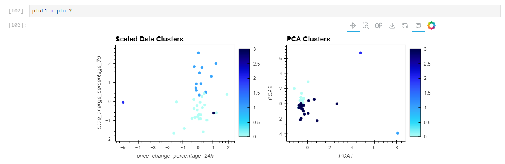

# Crypto Clustering

## Website: 
[website](https://github.com/Damiomo/CryptoClustering)

## Description
Here I used KMeans to create clusters.  Then I used Principal Componets on data frame, charted the data and analyzed.

## Table of Contents
- [Installation](#installation)

- [Credits](#credits)
- [License](#license)

- [Contact](#contact)

## Installation
KMneans, PCA, Python, and Pandas 

## Credits
Damilare Omoboriowo

## License
MIT

## Contact
If there are any questions or concerns, I can be reached at:
##### [github: Damiomo](https://github.com/Damiomo)
##### [email: Domoboriowo14@Gmail.com](mailto:Domoboriowo14@Gmail.com)
